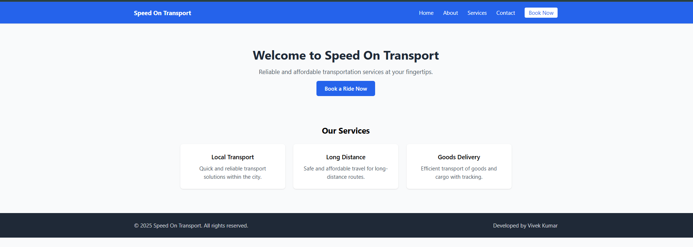
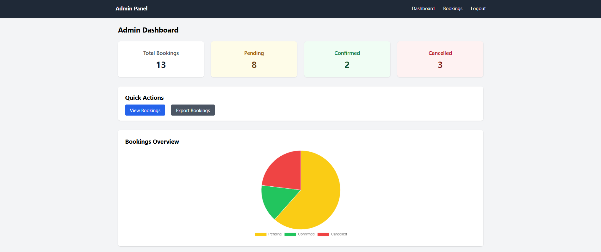
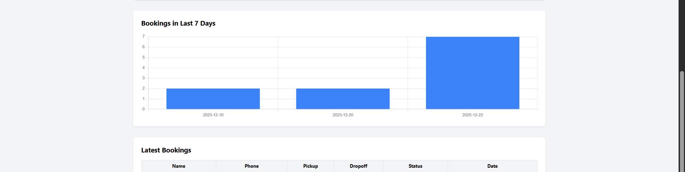
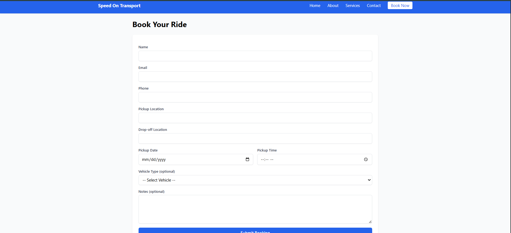

# 🚚 **Transport Booking System** 🛻

<p align="center">
  
</p>

---

## ✨ **What is this Project?**

This is a **fully functional Transport Booking System** developed using **Laravel** for handling transport bookings, admin dashboards, and real-time notifications. It's designed to simplify the booking process for transport services and allow admins to manage the system efficiently.

---

## 📸 **Features**

- **Booking System** for customers to request transport
- **Admin Dashboard** with stats and booking management
- **Real-Time Email Notifications** for customers and admins
- **Charts** (status distribution, daily bookings) for visual representation
- **Excel Export** for admins to export booking data
- **Queue-based Email System** for asynchronous email delivery

---

## 🚀 **Tech Stack**
Built with modern, efficient technologies:

- **Backend:** Laravel 12
- **Frontend:** Tailwind CSS
- **Database:** MySQL
- **Charts:** Chart.js
- **Excel Export:** Maatwebsite Excel
- **Email Service:** Laravel Mail (SMTP / Queue)

---

## 🔥 **How to Setup**

### 1️⃣ **Clone the Repository**

First, clone the repository to your local machine:

```bash
git clone https://github.com/your-username/transport-booking-system.git
cd transport-booking-system

2️⃣ Install Dependencies

Make sure you have Composer installed. Run:
bash:
composer install

3️⃣ Create the .env file

Copy the .env.example to .env:
cp .env.example .env

4️⃣ Generate Application Key

Laravel requires an application key for encryption. Generate it by running:
php artisan key:generate

5️⃣ Set Up the Database

Configure your .env file with your database credentials and run the migrations:
php artisan migrate

6️⃣ Run the Application

Serve the application locally:
php artisan serve

👨‍💻 Admin Dashboard Overview

Admin Authentication: Secure login for admins.

Statistics Cards: Total bookings, pending, confirmed, and canceled bookings.

Quick Actions: Links to view all bookings and export booking data.

Charts: Status breakdown (Pie Chart) and Daily Bookings (Bar Chart).

Latest Bookings: See the most recent 5 bookings on the dashboard.

📊 Screenshots & Preview
1. Homepage
1. Homepage  
   

2. Admin Dashboard  
     
   
3. Booking Form  
   

📩 Email Notifications

Customer Confirmation: An email with booking details is sent to customers.

Admin Notification: Admin gets an email when a new booking is created.


🛠️ Technologies Used

Laravel 12 - Powerful PHP framework

Tailwind CSS - Utility-first CSS framework

Chart.js - For data visualization (charts)

Maatwebsite Excel - Export bookings data to Excel

MySQL - Database for storing bookings

Queue Worker - Asynchronous email processing
   

🏗️ Deployment & Hosting

This application can be deployed to various hosting services, including Heroku, DigitalOcean, or Railway. Make sure to configure your environment variables properly (such as database credentials, mail service settings, etc.) for production.

For deployment on a VPS, ensure you have:

A web server (Nginx/Apache)

PHP 8+ with required extensions

Composer

MySQL/Postgres


🤝 Contributing

Feel free to open an issue or submit a pull request if you would like to contribute!


💻 Development Setup

If you would like to contribute, follow the setup steps above. Ensure that you run the necessary tests and adhere to the coding standards of the project.

📝 License

This project is open-source and licensed under the MIT License.


